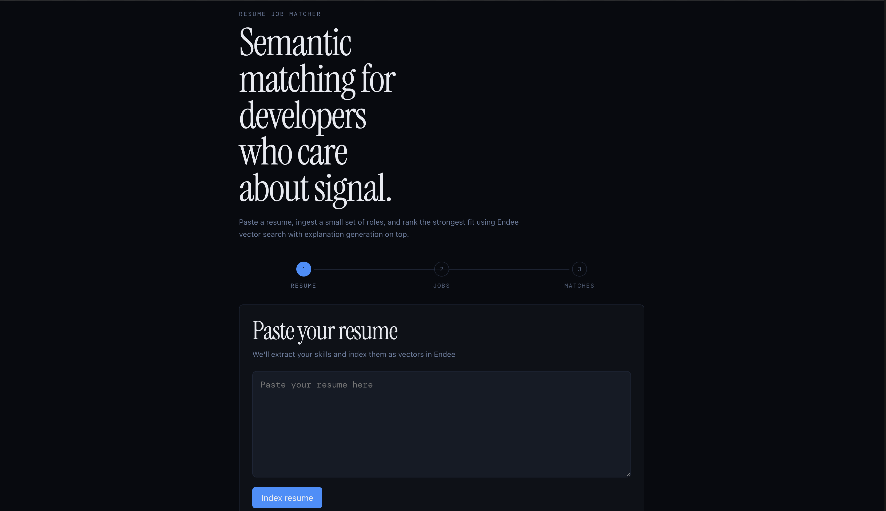

# Resume Job Matcher 🎯

Semantic job matching powered by Endee vector database + HuggingFace AI

## Problem Statement

Manual job searching is still heavily keyword-dependent, which means strong opportunities are often missed when the wording between a resume and a job description differs. A candidate may be highly relevant to a role semantically, but traditional filtering can fail to capture that relationship. This project solves that by embedding resumes and job descriptions into a shared vector space and ranking jobs by meaning, not just literal term overlap. The result is a more realistic, relevance-driven matching workflow built on vector similarity search with Endee.

## Demo



## How Endee is Used

Endee is the core retrieval layer of this project. The system creates and maintains two separate vector indexes:

- `resumes` for storing the user resume embedding
- `jobs` for storing each ingested job description embedding

The embedding dimension is fixed at **384**, matching the output of `BAAI/bge-small-en-v1.5`. Each index uses **cosine similarity** so semantically close resume and job vectors rank near one another even when exact keywords do not match.

The Endee operations used in this project are:

- `createIndex` to initialize vector indexes when they do not exist
- `upsert` to store embedded resume and job vectors with metadata
- `query` to perform Top-K similarity search for ranked matching

Endee was chosen because it fits the project constraints and the evaluation goal well:

- It provides high-performance vector search suitable for near real-time ranking
- It is simple to run locally as a single-node Docker service
- It avoids unnecessary infrastructure overhead for a student demo
- It exposes a clean TypeScript SDK that integrates directly into the backend service layer

All vector operations are routed through the dedicated Endee service wrapper in the backend. This is the actual TypeScript SDK usage pattern from the project:

```ts
import { Endee, Precision } from "endee";

const VECTOR_DIMENSION = 384;

let client: Endee | null = null;

export function getEndeeClient(): Endee {
    if (!client) {
        client = new Endee(process.env.ENDEE_AUTH_TOKEN || "");
        client.setBaseUrl(
            `${process.env.ENDEE_BASE_URL || "http://localhost:8080"}/api/v1`,
        );
    }
    return client;
}

export async function ensureIndexExists(indexName: string): Promise<void> {
    const c = getEndeeClient();
    try {
        await c.getIndex(indexName);
    } catch {
        await c.createIndex({
            name: indexName,
            dimension: VECTOR_DIMENSION,
            spaceType: "cosine",
            precision: Precision.INT8,
        });
    }
}

export async function upsertVector(
    indexName: string,
    id: string,
    vector: number[],
    meta: Record<string, unknown>,
): Promise<void> {
    await ensureIndexExists(indexName);
    const index = await getEndeeClient().getIndex(indexName);
    await index.upsert([{ id, vector, meta }]);
}

export async function queryVectors(
    indexName: string,
    vector: number[],
    topK: number,
) {
    await ensureIndexExists(indexName);
    const index = await getEndeeClient().getIndex(indexName);
    return index.query({ vector, topK });
}
```

## System Architecture

```text
User Resume Text
│
▼
HuggingFace Embeddings          Job Descriptions
(BAAI/bge-small-en-v1.5)              │
384-dim vectors                        ▼
│                    HuggingFace Embeddings
▼                         384-dim vectors
Endee resumes index               │
▼
Endee jobs index
│
┌───────────────┘
▼
Cosine Similarity Search
Top-K Ranked Results
│
▼
Mistral-7B Explanation
(HuggingFace free tier)
│
▼
Ranked Match Cards + Score
```

## Tech Stack

| Layer | Technology | Purpose |
| --- | --- | --- |
| Vector DB | Endee (Docker) | cosine similarity vector search |
| Embeddings | BAAI/bge-small-en-v1.5 | 384-dim semantic embeddings |
| LLM | Mistral-7B-Instruct | match explanation generation |
| Backend | Node.js + TypeScript + Express | REST API |
| Frontend | React + TypeScript + Vite + TailwindCSS | UI |
| Container | Docker Compose | Endee deployment |

## Features

- Resume ingestion with automatic skill extraction
- Job description ingestion and vectorization
- Semantic similarity matching (not keyword matching)
- AI-generated match explanations for top 3 results
- Shared skill highlighting between resume and job
- Match score percentage with color-coded relevance

## Project Structure

```text
resume-job-matcher/
├── PLAN.md
├── README.md
├── docker-compose.yml
├── .env.example
├── .gitignore
├── package.json
├── backend/
│   ├── package.json
│   ├── tsconfig.json
│   └── src/
│       ├── index.ts
│       ├── routes/
│       │   ├── resume.ts
│       │   ├── jobs.ts
│       │   └── match.ts
│       ├── services/
│       │   ├── endee.ts
│       │   ├── embeddings.ts
│       │   └── explain.ts
│       └── utils/
│           └── skills.ts
├── frontend/
│   ├── package.json
│   ├── vite.config.ts
│   ├── tailwind.config.js
│   ├── index.html
│   └── src/
│       ├── main.tsx
│       ├── App.tsx
│       ├── components/
│       │   ├── ResumeInput.tsx
│       │   ├── JobInput.tsx
│       │   ├── MatchResults.tsx
│       │   └── SkillBadges.tsx
│       └── api/
│           └── client.ts
└── demo/
    ├── sample_resume.txt
    └── sample_jobs.json
```

## Setup & Run

1. Prerequisites: Node.js 18+, Docker Desktop
2. Clone: `git clone https://github.com/raghul017/endee && cd endee`
3. Get free HuggingFace token at `huggingface.co/settings/tokens`
4. `cp .env.example .env` and add `HF_API_TOKEN`
5. `docker compose up -d`
6. `cd backend && npm install && npm run dev`
7. `cd frontend && npm install && npm run dev`
8. Visit `http://localhost:5173`

## API Reference

| Method | Endpoint | Description | Request Body |
| --- | --- | --- | --- |
| POST | `/api/resume/ingest` | Embed and store the resume in the `resumes` index | `{ "text": "resume text" }` |
| POST | `/api/jobs/ingest` | Embed and store a job description in the `jobs` index | `{ "title": "Full Stack Developer", "company": "Zepto", "description": "job description" }` |
| POST | `/api/match` | Query Endee with the resume vector and return Top-K ranked jobs | `{ "resumeText": "resume text", "topK": 5 }` |
| GET | `/api/jobs` | List all ingested jobs currently stored in memory | No body |
| GET | `/health` | Backend health check and Endee configuration visibility | No body |

## Mandatory Endee Repository Steps Completed

- [x] Starred the official Endee GitHub repository
- [x] Forked endee-io/endee to personal GitHub account
- [x] Built project on top of the forked repository
- [x] Endee TypeScript SDK used for all vector operations

## Author

Raghul AR | LPU | github.com/raghul017
